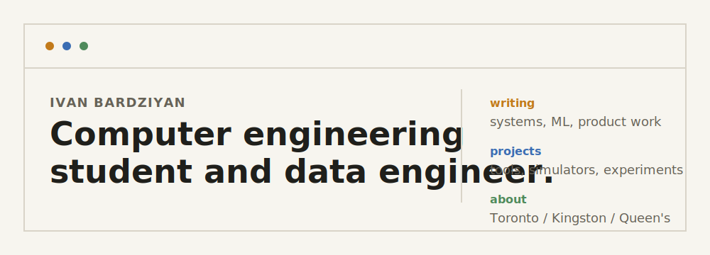

  

  <a href="https://bardz.ca">Website</a> /
  <a href="https://github.com/ivanbard">GitHub</a> /
  <a href="https://www.linkedin.com/in/ivanbardziyan/">LinkedIn</a> /
  <a href="mailto:ivanbardziyan@gmail.com">Email</a>

## Intro

Computer engineering student and data engineer building software and writing about systems, machine learning, and product work.

Based in Toronto and Kingston. Currently working as a Data Engineer at Royal Bank of Canada and studying at Queen's University.

## Index

| Section | Notes |
| --- | --- |
| [Writing](https://bardz.ca/blog) | Notes on systems, machine learning, and engineering work. |
| [Projects](https://bardz.ca/projects) | Software projects, hardware-adjacent tooling, and experiments. |
| [About](https://bardz.ca/about) | Background, current work, and what I am learning next. |

## Selected Work

| Project | Focus | Stack |
| --- | --- | --- |
| [Telchines](https://github.com/ivanbard/telchines) | CLI-first hardware verification toolkit for replayable retrieval, repair, triage, SVA/cocotb generation, adapters, and validation workflows. | Python, Hardware Verification, CLI |
| [Goldilocks Kingston](https://goldilocks-tau.vercel.app) | Smart home climate advisor using IoT sensor data, AI recommendations, electricity-rate awareness, savings tracking, and environmental impact views. | Next.js, IoT, AI |
| [GPU Simulator](https://github.com/ivanbard/GPU-sim) | Small-scale C++ GPU simulator focused on parallel compute concepts and systems-level architecture. | C++, Systems, Parallel Compute |
| [muscl3.com](https://muscl3.com) | Interactive 3D muscle map and exercise recommender for exploring training guidance visually. | React, 3D, Health Tech |
| [ASL Vision Interpreter](https://github.com/ivanbard/Elec376_F25_group13) | C++/OpenCV ASL transcription project using webcam input, hand detection, landmark extraction, and MediaPipe/OpenCV DNN support. | C++, OpenCV, Computer Vision |

## Toolkit

`Python` / `TypeScript` / `JavaScript` / `C++` / `React` / `Vite` / `OpenCV` / `Verilog` / `Git` / `Linux`

## Connect

I am always happy to talk about systems, product ideas, engineering internships, hardware projects, or ambitious side projects that need a builder.

[bardz.ca](https://bardz.ca) / [ivanbardziyan@gmail.com](mailto:ivanbardziyan@gmail.com) / `Toronto / Kingston`
